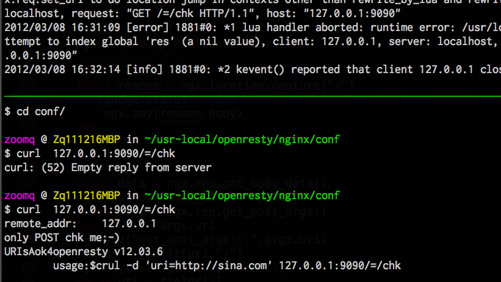

.. include:: LINKS.rst
.. |rsticon| image:: _static/rst.png

基于结构化文本~ |rsticon| 的图书工程
================================================================

Shinx 说明
-------------

参考:

    Sphinx快速开始 - pymotwcn
        - http://code.google.com/p/pymotwcn/wiki/SphinxprojectHowto

本书行文体例
--------------------------------------------------------------------

本书使用不同的体例来区分不同的情景. 

精巧地址
^^^^^^^^^^^^^^^^^^^^^^^^^^^^^^^^^^^^^^^^^^^^^^^^^^^^^^^^^^^^^^^^^^^^
  本书包含很多外部网站的URL地址,但是图书必竟不是网页,读者无法点击进入相关网站;所以,笔者尝试使用URL精简工具来帮助读者可以快速输入自动跳转到原有网站来访问;

    * 比如说: 本书的维基入口 http://wiki.woodpecker.org.cn/moin/ObpLovelyPython
    * 精巧地址: http://bit.ly/2QA425
    * 输入的字符量少了三倍! 这是借助 http://bit.ly 提供的网址精简服务达到的效果;
    * 提醒:毕竟这是借用外国的免费服务进行的精简,如果读者输入后不能自动跳转的话,可能是网络问题也可能是服务问题,那就只能麻烦读者重新使用原有的URL进入了;

程序体例
^^^^^^^^^^^^^^^^^^^^^^^^^^^^^^^^^^^^^^^^^^^^^^^^^^^^^^^^^^^^^^^^^^^^
使用有语法颜色的代码引用
::

    def foo():
        print "Love Python, Love FreeDome"
        print "E文标点,.0123456789,中文标点,. "

可以 用 `.. code-block::` 追加各种语法高亮声明::

    .. code-block:: python
        :linenos:

        def foo():
            print "Love Python, Love FreeDome"
            print "E文标点,.0123456789,中文标点,. "

效果:

.. code-block:: python
    :linenos:

    def foo():
        print "Love Python, Love FreeDome"
        print "E文标点,.0123456789,中文标点,. "

外部包含::

    .. literalinclude:: example.py
        :language: python

效果:

.. literalinclude:: example.py
    :language: python

文本体例
^^^^^^^^^^^^^^^^^^^^^^^^^^^^^^^^^^^^^^^^^^^^^^^^^^^^^^^^^^^^^^^^^^^^

**引用,题词:**

.. epigraph::

   No matter where you go, there you are.

   -- Buckaroo Banzai

**技巧警示:**

.. note:: (~_~)

    - This icon signifies a tip, suggestion, or general note.

.. warning:: (#_#)

    - 警告得注意的...

.. seealso:: (^.^)
    
    - 指向参考的...

**附加说明:**

.. topic:: 进一步的

    包含题外的信息,笔者心路,等等和正文有关,但是不直接的信息

**知识引用:**

.. sidebar:: 边注
    :subtitle: 表示以下内容出现在页面边注中

    表示以下内容出现在边注中
    将涉及内容指向后面的 ``PCS*``

- 使用边注
- 追随正文
- 活动説明
- 效果如右
- ....

rST排版技巧
-------------

跨章节指引
^^^^^^^^^^^^^^^^^^^^^^^^^^^^^^^^^^^^^^^^^^^^^^^^^^^^^^^^^^^^^^^^^^^^

- 行文中,经常要对其它章节进行指引,在 html 中对应的就是 锚点链接
- rST 中提供了非常优雅的解决:
    - 使用通用元素定义
    - 比如説:

::

  各个章节的首页一般是 index.rst
  头一行,习惯性加个聲明:
  .. _chapter2index:

  那么,在其它任意文本中,随时可以使用:
  :ref:`基本电子学 <chapter2index>` 
  来生成一个指向第二章 首页的链接!

插图/表格指代
^^^^^^^^^^^^^^^^^^^^^^^^^^^^^^^^^^^^^^^^^^^^^^^^^^^^^^^^^^^^^^^^^^^^

- 行文中,经常对指定插图/表格 进行指代
- rST 中提供了非常优雅的解决:
    - 进行通用元素定义
    - 比如说

::

  .. _fig_2_4:
  .. figure:: _static/figs/tmux-curl-test.png

     插图 2-4 命令行测试情景

然后,就可以在任意地方使用 :ref:`fig_2_4` 来指代,
实际输出的就是 "插图 2-4 命令行测试情景"

.. _fig_2_4:

   插图 2-4 命令行测试情景

上下标号
^^^^^^^^^^^^^^^^^^^^^^^^^^^^^^^^^^^^^^^^^^^^^^^^^^^^^^^^^^^^^^^^^^^^

有时要进行数学/化学的表示,在 html 中就需要上/下标( `` , ``) 的表达,
rST 中当然也有::

  H\ :sub:`2`\ O
  E = mc\ :sup:`2`

效果:

H\ :sub:`2`\ O

E = mc\ :sup:`2`

.. note:: 注意:

  这里的 \ 只是为了制造语法空间,输出时,是没有空格的了,,,

线性表格
^^^^^^^^^^^^^^^^^^^^^^^^^^^^^^^^^^^^^^^^^^^^^^^^^^^^^^^^^^^^^^^^^^^^

中文的非等宽性导致 rST 这种字符艺术式的图表很难作！ 

::

    =====  =====
     A    not A
    =====  =====
    False  True
    True   False
    =====  =====

所以,使用列表也可以方便的生成表格::

    .. list-table:: 实例
       :widths: 15 10 30
       :header-rows: 1

       * - Treat
         - Quantity
         - Description
       * - Albatross
         - 2.99
         - On a stick!
       * - Crunchy Frog
         - 1.49
         - If we took the bones out, it wouldn't be
           crunchy, now would it?
       * - Gannet Ripple
         - 1.99
         - On a stick!

**效果**

.. list-table:: 实例
   :widths: 15 10 30
   :header-rows: 1

   * - Treat
     - Quantity
     - Description
   * - Albatross
     - 2.99
     - On a stick!
   * - Crunchy Frog
     - 1.49
     - If we took the bones out, it wouldn't be
       crunchy, now would it?
   * - Gannet Ripple
     - 1.99
     - On a stick!

段落层次约定
^^^^^^^^^^^^^^^^^^^^^^^^^^^^^^^^^^^^^^^^^^^^^^^^^^^^^^^^^^^^^^^^^^^^

使用 reSTsections_

::

    共分4级    
    =======================
    大标题
    =======================

    -----------------------    
    小标题
    -----------------------    

    ^^^^^^^^^^^^^^^^^^^^^^^    
    二级标题
    ^^^^^^^^^^^^^^^^^^^^^^^    

    """""""""""""""""""""""    
    三级标题
    """""""""""""""""""""""    

再小，就使用列表!:

    - 列表项目1    
    - 列表项目2
    - ...

**效果:**

大标题
=======================

小标题
-----------------------

二级标题
^^^^^^^^^^^^^^^^^^^^^^^

三级标题
"""""""""""""""""""""""

