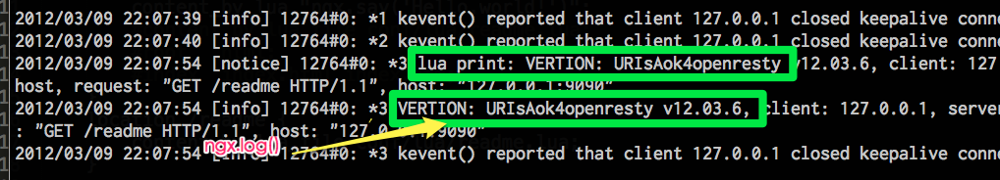
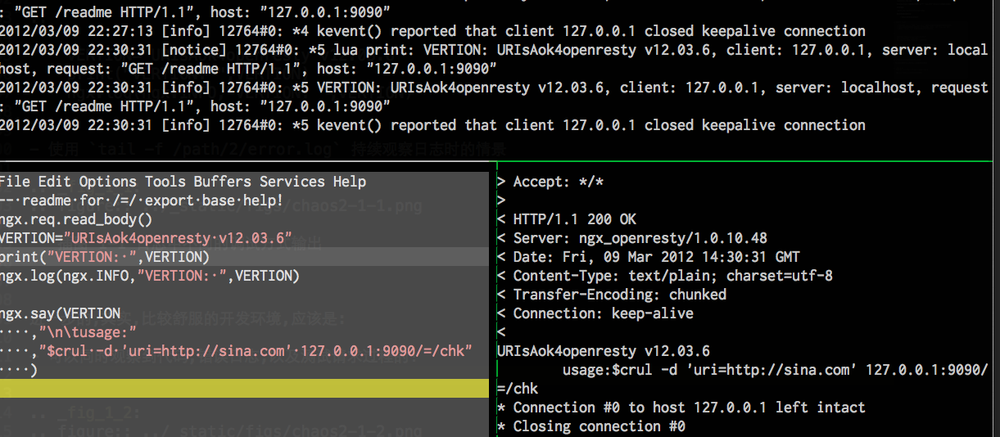

.. include:: ../LINKS.rst

+15分钟:突入 
==============

google 真心好朋友,通过搜索可以获得很多已经用上 `OpenResty`_ 的先驱们的各种代码片段

只要快速使用 `写lua->curl测试` 流程,结合以往的开发经验,驗证猜想,突进就好!

- 嗯嗯嗯,现在可以计时了: `22:01`

阵地
---------

增补 `my_openresty.conf` : ::

    server {
    ...
        location ~ ^/=/(\w+) {
            content_by_lua_file conf/lua/$1.lua;
            lua_code_cache off;
        }
    ...
    }

.. topic:: 解释一下

    - `~ ^/=/(\w+)` 就是説,处理所有对类似 `localhost:9090/=/abc` 形式的请求
    
        - `/=/` 只是笔者看来的合法 url 形式,以便和一般的服务请求区分
        - `(\w+)` 是基础的 `正则表达式`_ 意思是长度至少为一,全部由e文字母组成的字串

    - `conf/lua/$1.lua` 也是 `正则表达式`_ ,意思是匹配到 `conf/lua` 目录中所有和 url 请求同名的 `.lua` 脚本

        - 比如: `localhost:9090/=/abc`
        - 将试图执行: `conf/lua/abc.lua` 

创建 `chk.lua` :

.. code-block:: lua

    -- try openresty easy creat RESTful API srv.
    ngx.req.read_body()
    local method = ngx.var.request_method
    ngx.say("request_method:\t",method)

    if method ~= 'POST' then
        ngx.say('pls. /=/chk only work as POST ;-)')
    else
        ngx.say('realy working,,,')
    end

表忘记:

    - `$ /opt/sbin/openresty.server restart` 重启 `OpenResty`_ 中的 Nginx

工作环境
---------

- 根据 `ngx.var.request_method` 的状态值, 已经完成一个业务流程:

    - 如果是普通的 `GET` 请求,直接吼回提示,不处置
    - 如果是数据的 `POST` 请求,开始 `真正的干活`

.. sidebar:: 提示
    :subtitle: ngx.log

    而且,ngx.log() 的参数也不简单, 头一个 `ngx.INFO` 是 Nginx 的内置日志级别,

    是和配置中

    `error_log /path/2/error.log info;` 

    最后的收集级别要对应!

        - 否则,在日志中是见不到的!

.. note:: (~_~)

    - 其实,使用 `print` 或是 `ngx.log()` 都是可以直接将调试值输出到错误日志里的
    - 但是,会间杂在大量其它正当日志中,很不容易观察, 例如: :ref:`fig_1_1` 所示
    - 就是在 `readme.lua` 中增补两种调试打印代码引发的 

::

    VERTION="URIsAok4openresty v12.03.6"
    print("VERTION: ",VERTION)
    ngx.log(ngx.INFO,"VERTION: ",VERTION)

- 使用 `tail -f /path/2/error.log` 持续观察日志时的情景

.. _fig_1_1:

   插图 1-1 日志中不同的调试方式输出

进一步的,其实,比较舒服的开发环境,应该是:

- 可以同时观察到代码,错误日志,以及测试请求过程的!
- 俺推荐使用 `tmux`_ 作为多窗格终端
- 具体情景如 :ref:`fig_1_2` 所示

    - 上方是 `tail -f /path/2/error.log` 监察
    - 下左是脚本编辑
    - 下右是 curl 请求测试区

.. _fig_1_2:

   插图 1-2 使用tumx 同时进行观察的情景

搞掂
---------

好的,什么都整顿舒服了,就可以快速一条条试错的方式,堆出所有业务逻辑了!

.. code-block:: lua

    local method = ngx.var.request_method
    --各种事先申請好的 金山网址云 接口授权信息
    APPKEY = "k-60666"
    SECRET = "99fc9fdbc6761f7d898ad25762407373"
    ASKHOST = "http://open.pc120.com"
    ASKTYPE = "/phish/?"
    --内部辅助函式,组成 金山网址云 需要的查询請求链接
    function checkForValidUrl(uri)
        crtURI = ngx.encode_base64(uri)
        timestamp = ngx.now()
        ngx.say('timestamp:\t',timestamp)
        signbase = ASKTYPE .. "appkey=" .. APPKEY .. "&q=" .. crtURI .. "&timestamp=" .. timestamp
        sign = ngx.md5(signbase .. SECRET)
        return ASKHOST .. signbase .. "&sign=" .. sign
    end

    if method ~= 'POST' then
        ngx.say('pls. only POST chk me;-)')
    else
        local data = ngx.req.get_body_data()
        ngx.say("get_body_data:\t",data)
        local args = ngx.req.get_post_args()
        local uri = args.uri
        ngx.say("args.uri:\t",uri)
        local chkURI = checkForValidUrl(uri)
        ngx.say(chkURI)   
    end

测试输出如: ::

    $ curl -d "uri=http://sina.com" localhost:9090/=/chk
    get_body_data:  uri=http://sina.com
    args.uri:       http://sina.com
    timestamp:      1331304634.315
    http://open.pc120.com/phish/?appkey=k-60666&q=aHR0cDovL3NpbmEuY29t\
    &timestamp=1331304408.315&sign=d7e80af8f0f83438e315e320eba4efe6

`HttpLuaModule <http://wiki.nginx.org/HttpLuaModuleZh>`_ 真心 `碉堡` 了! 所有最常见的操作都内置了!

- 字串的 `base64` 编码: `ngx.encode_base64()`
- 字串的 `md5` 编码: `ngx.md5()`
- 当前时间戮: `ngx.now()`
- `POST` 上来的数据体 `ngx.req.get_body_data()`
- 数据体的解析: `ngx.req.get_post_args()`
- 实际数据的引用: `args.uri`

但是,怎么 `向外部url发出请求并接收数据?!`

luarocks
^^^^^^^^^^^^^^^^^

`摇滚吧! Lua....`

和所有成熟的开发语言一样, `Lua`_ 也有自个儿的第3方扩展包管理平台:

    |luarocks|

真心有爱的方便工具!

- 安装?! `下载,解开,./configure,make,make install`
- 使用? 先搜索

::

    $ luarocks search url

    Search results:
    ===============

    Rockspecs and source rocks:
    ---------------------------

    luacurl
       1.2.1-1 (src) - http://luarocks.org/repositories/rocks
       1.2.1-1 (rockspec) - http://luarocks.org/repositories/rocks
       1.1-3 (src) - http://luarocks.org/repositories/rocks
       1.1-3 (rockspec) - http://luarocks.org/repositories/rocks
       1.1-2 (src) - http://luarocks.org/repositories/rocks
       1.1-2 (rockspec) - http://luarocks.org/repositories/rocks

- 安装扩展

::

    $ luarocks install luacurl
    Installing http://luarocks.org/repositories/rocks/luacurl-1.2.1-1.src.rock...
    Using http://luarocks.org/repositories/rocks/luacurl-1.2.1-1.src.rock... switching to 'build' mode
    Archive:  /tmp/luarocks_luarocks-rock-luacurl-1.2.1-1-8288/luacurl-1.2.1-1.src.rock
      inflating: luacurl-1.2.1-1.rockspec  
     extracting: luacurl-1.2.1.zip       
    Archive:  luacurl-1.2.1.zip
       creating: luacurl-1.2.1/
      inflating: luacurl-1.2.1/CMakeLists.txt  
      inflating: luacurl-1.2.1/luacurl.c  
    export MACOSX_DEPLOYMENT_TARGET=10.3; gcc -O2 -fPIC -I/usr/local/include -c luacurl.c -o luacurl.o -I/usr/include
    export MACOSX_DEPLOYMENT_TARGET=10.3; gcc -bundle -undefined dynamic_lookup -all_load -o luacurl.so -L/usr/local/lib luacurl.o -L/usr/lib -lcurl
    Updating manifest for /usr/local/lib/luarocks/rocks

    luacurl 1.2.1-1 is now built and installed in /usr/local/ (license: MIT/X11)

- 使用?! 参考: `官方手册 <http://lua-curl.luaforge.net/>`_
- 以及: [Lua-cURL by msva](http://msva.github.io/lua-curl/)
- 

抄个小函式就好: 

.. code-block:: lua

    curl = require "luacurl"
    function _fetch_uri(url, c)
        local result = { }
        if c == nil then 
            c = curl.new() 
        end
        c:setopt(curl.OPT_URL, url)
        c:setopt(curl.OPT_WRITEDATA, result)
        c:setopt(curl.OPT_WRITEFUNCTION, function(tab, buffer)
            table.insert(tab, buffer)
            return #buffer
        end)
        local ok = c:perform()
        return ok, table.concat(result)
    end

- 感谢 TooNTonG 的提醒
    - 这里使用 Lua-cURL 的对外请求是阻塞的,这也是俺的期望...
    - 参考: `IO - 同步，异步，阻塞，非阻塞 （亡羊补牢篇） - 智障大师 <http://blog.csdn.net/historyasamirror/article/details/5778378>`_

- 增补到工作脚本中

.. code-block:: lua

    --前略,,,
    local chkURI = checkForValidUrl(url)
    --ngx.say(chkURI)
    ok, html = _fetch_uri(chkURI)
    ngx.say("_fetch_uri:\t", ok, "\t", html)

- 测试,确认效果: ::

    ...
    http://open.pc120.com/phish/?appkey=k-60666&q=aHR0cDovL3NpbmEuY29t&timestamp=1331306157.315&sign=4190815f3920d9bbd0d1410525343a0e
    _fetch_uri:     true    {"success":1,"phish":0}

基本功能,达成, `收功!`

小结
---------

`37:00` ~ 这一堆,一刻鈡,整出来不难吧?

想来:
- 其实,关键功能性行为代码,就8行

    - 其中7 行全部可以在一篇文档中查到: `HttpLuaModule <http://wiki.nginx.org/HttpLuaModule>`_ 
    - 仅仅有一行,是需要学习新的工具,安装新的组件,学习新的文档,抄进来新的函式
    - 即: `ok, html = _fetch_uri(chkURI)`

- 其余,都是力气活儿

    - 只要别抄錯
    - 都是赋值,赋值,赋值,赋值,,,,

- 只要注意每一步,都使用 `ngx.say()` 吼回来,测试确认无误,就可以继续前进了,,,

`这就是脚本语言的直觉式开发调试体验!`

