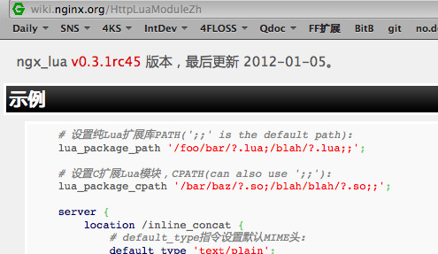

.. include:: ../LINKS.rst

+5分钟:重构
==============

设计 ::

    /usr/local/openresty/nginx/conf
        +- my_openresty.conf    业务路由配置
          +- lua/               业务脚本入口
            +- readme.lua       /readme 响应
            +- chk.lua          /=/chk 响应
            +- ksc.lua          可复用的功能包

模块化
-----------

所以,兴冲冲,将代码分离出来:

.. code-block:: lua

    -- KCS API support 
    module("ksc", package.seeall)
    --curl as lua
    curl = require "luacurl"
    function _fetch_uri(url, c)
        local result = { }
        if c == nil then 
            c = curl.new() 
        end
        c:setopt(curl.OPT_URL, url)
        c:setopt(curl.OPT_WRITEDATA, result)
        c:setopt(curl.OPT_WRITEFUNCTION, function(tab, buffer)
            table.insert(tab, buffer)
            return #buffer
        end)
        local ok = c:perform()
        return ok, table.concat(result)
    end
    -- global var
    --ngx.say(PHISHTYPE["2"])
    APPKEY = "k-60666"
    SECRET = "99fc9fdbc6761f7d898ad25762407373"
    ASKHOST = "http://open.pc120.com"
    ASKTYPE = "/phish/?"
    function checkForValidUrl(uri)
        crtURI = ngx.encode_base64(uri)
        timestamp = ngx.now()
        signbase = ASKTYPE .. "appkey=" .. APPKEY .. "&q=" .. crtURI .. "&timestamp=" .. timestamp
        sign = ngx.md5(signbase .. SECRET)
        return ASKHOST .. signbase .. "&sign=" .. sign
    end

精简原 `chk.lua` 

.. code-block:: lua

    ngx.req.read_body()
    local method = ngx.var.request_method
    local KSC = require "ksc"

    if method ~= 'POST' then
        ngx.say('pls. only POST chk me;-)')
    else
        local args = ngx.req.get_post_args()
        local uri = args.uri
        local chkURI = KSC.checkForValidUrl(uri)
        ok, html = KSC._fetch_uri(chkURI)
        ngx.say("_fetch_uri:\t", ok, "\t", html)
    end

`哗! 业务逻辑首屏得见!`

撞!
^^^^^^^^^^^^
但是! 立即...

::

        *1 lua handler aborted: runtime error: 
        /usr/local/openresty/nginx/conf/lua/chk.lua:6: module 'ksc' not found:
        no field package.preload['ksc']
        no file '/usr/local/openresty/lualib/ksc.lua'
        no file './ksc.lua'
        no file '/usr/local/openresty/luajit/share/luajit-2.0.0-beta9/ksc.lua'
        no file '/usr/local/share/lua/5.1/ksc.lua'
        no file '/usr/local/share/lua/5.1/ksc/init.lua'
        no file '/usr/local/openresty/luajit/share/lua/5.1/ksc.lua'
        no file '/usr/local/openresty/luajit/share/lua/5.1/ksc/init.lua'
        no file '/usr/local/openresty/lualib/ksc.so'
        no file './ksc.so'
        no file '/usr/local/lib/lua/5.1/ksc.so'
        no file '/usr/local/openresty/luajit/lib/lua/5.1/ksc.so'
        no file '/usr/local/lib/lua/5.1/loadall.so', client: 127.0.0.1, server: localhost, request: "POST /=/chk HTTP/1.1", host: "127.0.0.1:9090"

        ...

明显是没有找到 `ksc.lua` 包, 为毛?!
- 一通乱 搜索
- 据某处的示例修订:

.. code-block:: lua

        -- ksc.lua
        module(..., package.seeall)
        ,,,
        -- chk.lua
        local KSC = require "lua.ksc"

- 并增补 `my_openresty.conf`

::

    server {
        lua_package_path '/usr/local/openresty/nginx/conf/lua/?.lua;;';
        ...

- `/opt/sbin/openresty.server reload` 热加载新的配置文件

就可以了!

仔细...
-----------

可是,立即遭到了 `agentzh`_ 的劝戒,,,
- 再尝试,才知道

  - `lua_package_path` 不允许用在 `server` 或是 `location` 域中,只能在 `http` 中!
  - `lua_package_path` 增补后, Nginx 仅仅 `reload` 可能不加载这一行为,最好 `restart` !

- 不相信! 尝试一下,才真正见到日志中的 `[emerg]` 

::

        Checking configuration for correct syntax and
        then trying to open files referenced in configuration...
        nginx: [emerg] "lua_package_path" directive 
        is not allowed here in 
        /usr/local/openresty/nginx/conf/my_openresty.conf:10
        nginx: configuration file 
        /usr/local/openresty/nginx/conf/nginx.conf test failed

- 其实,这本身,在 `HttpLuaModule <http://wiki.nginx.org/HttpLuaModule>`_ 的维基手册示例第一行就 `暗示` 过!

.. _fig_2_1:

   插图 2-1 维基中手册文档的提示

.. warning:: (~.~)

    - 这得要多少 `心灵相通` 才意识的到吼?!

快速修订回来:

.. code-block:: lua

        -- ksc.lua
        module("ksc", package.seeall)
        ,,,

        -- chk.lua
        local KSC = require "ksc"

**一切如愿鸟 !-)**

复用?
-----------

对于各种意外,其实,很想直接使用 `/readme` 中的输出就好的,

- 根据以往幻灯中的提示,使用 `ngx.location.capture()`

.. code-block:: lua

    if method ~= 'POST' then
        ngx.say('pls. only POST chk me;-)')
        local readme = ngx.location.capture("/readme")
        if readme.status == 200 then
            ngx.say(readme.body)
        end

效果 ::

        $ curl  localhost:9090/=/chk
        pls. only POST chk me;-)
        URIsAok4openresty v12.03.6
                usage:$crul -d 'uri=http://sina.com' 127.0.0.1:9090/=/chk

**BINGO!**

小结
-----------

`42:01` ~ 这两个重构,纯粹是复制/粘贴,5分鈡,整出来不难吧?

- 但是,过程中的心理冲突,绝对不轻
- 比如,为毛 `ngx.redirect()` 不 `重定向` ?!

    - 俺是首先尝试使用 `重定向` 来合并输出的
    - 结果,只是使用标准的 http 302 状态码返回而已

- 等等,都需要补课,老实查阅文档,认真领悟,大胆尝试,建立靠谱的思路和反应,,,

